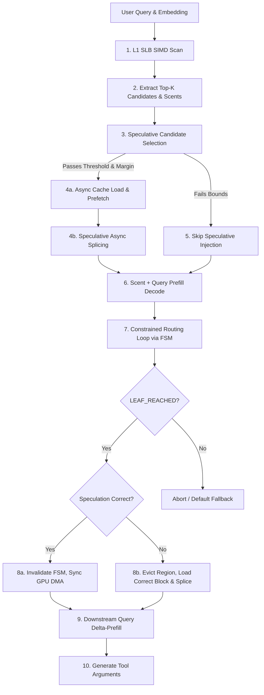

# Project Nexus: Architecture Specification

This document defines the high-level system architecture, context lifecycles, memory models, and topological hardware constraints of Project Nexus.

---

## 1. High-Level System Architecture Blueprint

Nexus functions as a hardware-aware Memory Management Unit (MMU) for the LLM's context window. Instead of treating KV tensors as a flat, append-only buffer, Nexus partition-splicing decouples prompt-evaluation contexts to resolve schema prefill costs dynamically:



---

## 2. The Two-Stage RoPE Context Lifecycle

The Rotary Positional Embedding (RoPE) algorithm encodes absolute position indices directly into Key and Value tensors. Positional rotation values $\mathbf{R}_{\Theta, m}^d \mathbf{x}$ depend on the exact token coordinate $m$. Inserting a tool schema block at the beginning of the context shifts the coordinates of downstream tokens, invalidating their precomputed KV cache representations.

To resolve this position-displacement constraint without full context recalculation, Nexus implements a **Two-Stage Context Lifecycle**:

```
STAGE 1: The Routing Context (Prefill & Constrained Generation)
+-------------------+--------------------+------------------------+
| System Prompt     | Top-3 Scents       | User Query             |
| [0 ... 255]       | [256 ... 270]      | [271 ... 271+Q-1]      |
+-------------------+--------------------+------------------------+
                  FSM Navigation starts at pos 256.
                  Logit masking constrains vocabulary to valid trie paths.

STAGE 2: The Execution Context (Page Fault & Splice)
+-------------------+--------------------------------+------------------------+
| System Prompt     | Spliced Tool Schema (ATB Cache) | User Query             |
| [0 ... 255]       | [256 ... 256+S_len-1]          | [256+S_len ... +Q-1]   |
+-------------------+--------------------------------+------------------------+
                  Spliced block contains pre-computed, pre-rotated KV values.
                  User Query is re-evaluated at position 256 + S_len.
```

### Stage 1: The Routing Phase
1. **Hidden State Extraction**: The user query is tokenized, and the final token's float hidden state vector is evaluated to generate a semantic embedding.
2. **SLB Scan**: The embedding is matched against the quantized L1 Semantic Lookaside Buffer to extract candidate tool "scents".
3. **Scents Prefill**: The top 3 matching semantic scents (5-token fixed sequences representing schema boundaries) are prepended. The orchestrator decodes this combined segment starting at `base_pos` (default 256).
4. **FSM Routing**: FSM logit masking restricts vocab options. Since scents are loaded in context, the model generates the target path deterministically.

### Stage 2: The Execution Phase
5. **Context Eviction**: Upon FSM leaf resolution (`LEAF_REACHED`), the orchestrator clears all sequence cache blocks downstream of `base_pos` (256) using `llama_kv_cache_seq_rm`.
6. **KV Splicing**: The pre-compiled `.atb` file corresponding to the resolved tool ID is mapped. If it matches the speculative candidate already pre-spliced, Nexus simply flushes FSM tokens and synchronizes the GPU command queue. If it is a new candidate, Nexus performs a targeted 2D stride-aware memory blit into the active KV cache.
7. **Query Delta-Prefill**: The user query is tokenized again and evaluated at position `256 + S_len`. Since the large tool schema ($S_{len}$ tokens) was spliced in, the query is prefilled downstream of it in a fraction of a millisecond.
8. **Generation**: The LLM resumes argument extraction in the presence of the full schema context.

---

## 3. Physical Hardware Topologies: UMA vs. NUMA

The physical performance of Project Nexus is governed by host/device topology limits.

```
       APPLE SILICON (UMA)                      DISCRETE GPU SERVER (NUMA)
+-----------------------------------+     +-----------------------------------+
|       Unified Memory Pool         |     | Host RAM (Node 0)  Host RAM (Node 1)
|     /                     \       |     |   [ mmap page ]      [ mmap page ]    
| [CPU Cores] <----> [Metal GPU Cores]    |         \                 /       |
|            (Zero-Copy)            |     |        [Interconnect (UPI/QPI)]   |
+-----------------------------------+     |                 |                 |
                                          |        [PCIe Gen4 Switch]         |
                                          |                 |                 |
                                          |           [Discrete GPU]          |
                                          +-----------------------------------+
```

### Apple Silicon Unified Memory Architecture (UMA)
On macOS Apple Silicon chips (e.g., M4 Max), the CPU and GPU cores share the same physical silicon memory bus.
* **DMA Fallacy**: The concept of "PCIe DMA transfers" does not exist on Apple Silicon. Tensors remain in unified memory.
* **Fast-Blit Mechanics**: When memory mapping via POSIX `mmap`, pages exist in unified cache. `ggml_backend_tensor_set` triggers a memory block copy within physical RAM. The Metal driver uses zero-copy pointers, completing a 1.5GB schema swap in **$<0.05\text{ ms}$**.

### Discrete GPU Clusters (NUMA Topology)
On discrete GPU clusters running Linux (e.g., Intel/AMD dual-socket servers with NVIDIA H100 cards), system memory is split into Non-Uniform Memory Access (NUMA) nodes.
* **The "First Touch" Trap**: The Linux OS allocates physical memory pages under a "First Touch" policy. When a file is mapped via `mmap`, physical pages are not allocated until they are touched. If the touch loop runs on a CPU core bound to NUMA Socket 0, but the GPU card is connected to PCIe lanes routed to NUMA Socket 1, every DMA transfer must traverse the slow CPU-to-CPU interconnect (UPI/QPI), halving the physical PCIe bandwidth.
* **NUMA Interleaving Solution**: Nexus resolves this by executing aligned system calls (`SYS_mbind`) prior to page-touching, forcing page distribution across node boundaries (`MPOL_INTERLEAVE`). This ensures physical pages reside near the GPU's PCIe root complex, maximizing direct DMA transfer bandwidth.

---

## 4. Multi-Tenant Scalability & Lock-Contention Mitigation

In enterprise scale environments hosting over 50,000+ cached tool schema blocks, standard memory managers crash into lock contention.

### Probabilistic Eviction ($\mathcal{O}(1)$ Constant Complexity)
* Linear sweeps through a massive hash map under a global write-lock violate Amdahl's Law, blocking concurrent serving threads.
* Nexus utilizes a Redis-style probabilistic random eviction solver. Instead of scanning the entire map, it samples $K = 5$ random buckets from the hash map under the write-lock. It compares the atomic `last_access_tick` metadata of only these sampled elements and evicts the one with the lowest value. This bounds lock contention to sub-microsecond timescales.

### Asynchronous Page residency
* OS page faults and memory pinning (`llama_register_host_memory`) are blocking IO operations. 
* Nexus shifts this entire sequence to an asynchronous thread pool. The orchestrator issues non-blocking prefetch instructions. The background worker touches pages and registers memory, notifying the cache structure upon completion.

### Dual-Layer Exception Safety & Recovery
* If an IO error or memory allocation failure occurs in the background mapping thread, a naive system leaves the pending key in the cache map, which permanently poisons subsequent threads.
* Nexus implements a structured callback registry. In the event of a loading exception, the background thread fires a callback that re-acquires the write-lock and erases the poisoned cache key. Waiting threads cleanly capture the exception from the `shared_future` and can retry, maintaining cache integrity.
