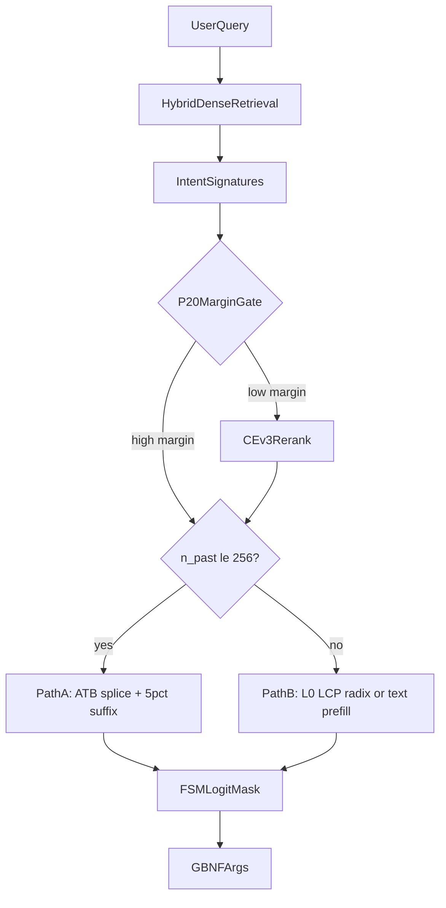

# Project Nexus v1.0: System Architecture

Nexus v1.0 is a **Hybrid C++23 Agentic Routing Engine and KV-Cache MMU** on llama.cpp. It pre-compiles MCP tool schemas into offline `.atb` KV blocks, routes tools via quantized retrieval and a radix trie FSM, and splices KV into the active context within strict physical boundaries.

**Production headline:** Gateway TTFT P50 **171 ms**, E2E tool-hit **0.91** (n=100, Qwen2.5-14B-Instruct Q4_K_M, Darwin arm64). Source: [`results/bench_gateway_e2e_v2.json`](../results/bench_gateway_e2e_v2.json).

**Honest speedup claim:** **2.8×** vs B3 retrieve-and-prefill baseline (N1 **466 ms** vs B3 **1.32 s**). The **153×** bloat strawman ratio is retired.

---

## 1. Production Ship Path

```
User Query
  → Hybrid Dense Retrieval (INT8 SIMD, < 5 µs)
  → Transient Intent Signatures (dense/CE document enrichment)
  → P20 Adversarial Margin Gate → CE v3 Rerank (~20% fire rate)
  → Context Depth Check (P ≤ 256?)
      ├─ Path A: ATB KV Splice + 5% Suffix Recompute
      └─ Path B: Exact-Token L0 Radix Copy / Text Prefill
  → Trie FSM Logit-Masked Decode
  → GBNF Argument Generation (Python)
```



---

## 2. Dual-Path Physical Boundaries

| Path | Condition | Mechanism |
|------|-----------|-----------|
| **Path A (Fast)** | $P = n_{\text{past}} \le 256$ | POSIX-mapped `.atb` splice + 5% suffix recompute |
| **Path B (Deep / Scale)** | $P > 256$ | Exact-token L0 radix warm copy or B3pc-style text prefill |

Enforcement: `max_splice_pos_` (default 256) in `NexusOrchestrator::route_and_splice`. When $P > 256$, splice returns `tool_id = 0` and Python `_prefix_cache_text_fallback` runs `decode_tokens` on the selected schema.

At $P = 256$, 5% suffix recompute: KL mean **0.0076** nats, top-1 agreement **1.00**.

At $P \ge 1024$, partial scattered recompute fails (KL up to **5.72**). See [`results/g4_gate_verdict.json`](../results/g4_gate_verdict.json).

---

## 3. L0 Cache — Exact-Token LCP Radix Tree

Path B uses `NexusRadixPrefixCache` ([`src/nexus_seq_warm_cache.hpp`](../src/nexus_seq_warm_cache.hpp)):

- **Zero-allocation exact-token longest common prefix (LCP) radix tree**
- **Left-Child Right-Sibling (LCRS)** flat memory arena: `node_arena_` + `token_arena_`
- 32 warm `llama_seq_id` pool slots (`POOL_BASE = 1`)
- Hit path: walk token edges, match full edge strings, `llama_kv_cache_seq_cp` on best pool slot
- **No FNV-1a chunking on the hit path** (purged in Phase 3 DOD refactor)

Validated: copy P50 **~3 µs**, hit rate **66%** — [`results/bench_phase28_radix_prefix_v2.json`](../results/bench_phase28_radix_prefix_v2.json).

FNV-1a remains only for `.atb` `model_hash` (topology fingerprint) and block-cache filepath keys — not for L0 prefix matching.

---

## 4. ML Pipeline (M3)

### 4.1 Transient Intent Signatures

[`test/nexus_retrieval.py`](../test/nexus_retrieval.py): `_intent_signature_prefix()` prepends verb/action text via `enriched_tool_document_text()`. Applied to dense and CE documents only — **not** BM25 or generative routing prompts.

### 4.2 P20 Dense Margin Gating

[`scripts/calibrate_margin_threshold.py`](../scripts/calibrate_margin_threshold.py) → [`src/nexus_calibration.py`](../src/nexus_calibration.py):

| Constant | Value | Role |
|----------|-------|------|
| `CALIBRATED_MARGIN_THRESHOLD` | **0.01365** | Production routing threshold (P20 adversarial) |
| `CALIBRATED_AMBIGUOUS_MARGIN` | **0.15** | Audit only — **not applied in routing** |

~**20%** CE invocation rate. Audit trail: [`results/margin_calibration_p20.json`](../results/margin_calibration_p20.json).

### 4.3 Synthetic-Only CE v3

Default checkpoint: `results/tool_cross_encoder_finetuned_v3` (gitignored — train locally).

```sh
python3 scripts/train_cross_encoder.py --output results/tool_cross_encoder_finetuned_v3
```

Training data: synthetic paraphrases only ([`scripts/synthetic_ce_training_data.py`](../scripts/synthetic_ce_training_data.py)). Zero E2E leakage.

M3 eval: dense Recall@1 **0.87**, CE Recall@1 **0.90** — [`results/recall_miss_analysis_v2.json`](../results/recall_miss_analysis_v2.json).

---

## 5. The Graveyard

Purged approaches and why they failed:

| Approach | Verdict | Root Cause |
|----------|---------|------------|
| **ColBERT MaxSim** | Disqualified | P50 **709 µs** vs <5 µs SLB budget; Recall@1 **0.72** — [`bench_phase22_maxsim.json`](../results/bench_phase22_maxsim.json) |
| **LegoLink** (partial/scattered recompute) | FAIL | KL up to **5.72** at P=1024; full-chunk ~1.4 s research-only — [`g4_gate_verdict.json`](../results/g4_gate_verdict.json) |
| **Blockmask Orchestrator** (N1m multi-tool) | FAIL | Tensor KL=0 but **e2e tool_accuracy 0.0** — causal isolation prevents cross-tool comparison — [`bench_n1m_fidelity_blockmask.json`](../results/bench_n1m_fidelity_blockmask.json) |
| **FNV-1a 32-token chunking** | Purged | **0% L0 hit rate**, terminal-leaf mismatch, cache fragmentation; replaced by exact-token LCP radix |
| **P>256 ATB splice** | Blocked | RoPE phase drift corrupts injected KV tensors; physics boundary enforced by orchestrator |

---

## 6. Empirical Results

### 6.1 Gateway production (v1.0 headline)

| Arm | Tool-hit | TTFT P50 |
|-----|----------|----------|
| `GW_route` | **0.91** | **171 ms** |

Source: [`results/bench_gateway_e2e_v2.json`](../results/bench_gateway_e2e_v2.json)

### 6.2 E2E baselines

| Arm | Tool-hit | TTFT P50 | Role |
|-----|----------|----------|------|
| B1 | 0.98 | **9.48 s** | Strawman (retired) |
| B3 | **0.91** | **1.33 s** | Honest baseline |
| N1 | 0.85–0.86 | 466–482 ms | Fast splice path |
| B3pc_hit | 0.91 | 331 ms | Prefix-cache warm tier |

Source: [`results/bench_e2e_v2.json`](../results/bench_e2e_v2.json), [`results/bench_e2e.json`](../results/bench_e2e.json)

### 6.3 TTFT decomposition

Warm splice P50 **7.4 ms**; full bloat prefill **96.46 s** (microbench). Source: [`results/bench_phase21_ttft_real.json`](../results/bench_phase21_ttft_real.json).

---

## 7. Hardware Topology

| Topology | Splice path | Notes |
|----------|-------------|-------|
| Apple Silicon UMA | Zero-copy mmap → Metal | Primary validation platform |
| NUMA x86 | PCIe blit required | Stride-aware K/V copy in `NexusKvSplicer` |

---

## 8. Canonical Artifacts

See [`results/README.md`](../results/README.md) for the v1.0 whitelist. Deep implementation detail: [`docs/internals.md`](internals.md).
